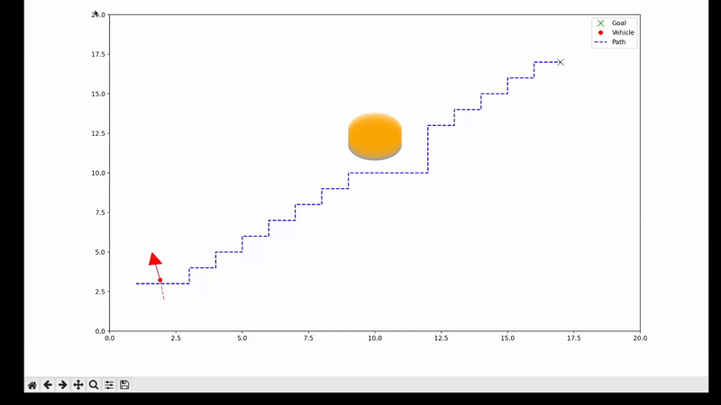

# Autonomous Vehicle Path Planner


This project implements a 2D autonomous vehicle path planner using Python. It simulates real-time path planning and trajectory following in a dynamic environment with moving obstacles. The system combines A* pathfinding, car-like vehicle kinematics, obstacle prediction, and PID control to demonstrate core concepts relevant to autonomous systems, robotics, and advanced controls.

---

## Demonstration



The system simulates a vehicle navigating toward a goal while predicting obstacle movement and updating its path in real time. The simulation includes:

- Path updates every time step
- Ghosted prediction overlays for obstacle trajectories
- Directional arrows to indicate vehicle heading

---

## Features

- A* path planning in a 2D continuous environment
- Real-time replanning to adapt to dynamic obstacles
- Obstacle motion prediction (linear/sinusoidal forecasting)
- Non-holonomic vehicle kinematics (bicycle model)
- PID-based trajectory following controller
- Real-time visualization with orientation, trails, and prediction overlays

---

## File Structure

```
autonomous-path-planner/
│
├── main.py                         # Main simulation loop
├── requirements.txt                # Python dependencies
├── assets/
│   ├── demo.gif                    # Simulation demo animation
│   └── banner.png                  # Optional GitHub banner
├── simulation/
│   ├── environment.py              # 2D simulation space and obstacle handling
│   ├── vehicle.py                  # Vehicle model and motion
│   ├── planner.py                  # A* pathfinding algorithm
│   ├── controller.py               # PID control for following path
│   ├── obstacle.py                 # Moving obstacle behavior
│   ├── predictor.py                # Predict future obstacle locations
│   └── visualize.py                # Real-time plotting and simulation UI
├── tests/
│   ├── test_path_planning.py
│   └── test_vehicle_model.py
└── README.md
```

---

## Getting Started

### 1. Installation

Ensure Python 3.10+ is installed. Then install dependencies:

```bash
pip install -r requirements.txt
```

### 2. Run the Simulation

```bash
python main.py
```

A live 2D simulation window will appear showing the vehicle, obstacles, and path updates.

---

## Resume / Portfolio Summary

> Developed a dynamic path planning simulation using A* search, PID control, and kinematic vehicle modeling. Implemented obstacle forecasting and real-time replanning to simulate autonomous navigation in constrained environments.

---

## Future Work

- Upgrade to Model Predictive Control (MPC)
- Integrate realistic maps or warehouse layouts
- Add velocity profiling and motion smoothing
- Generate animation/video export for demonstration

---

## License

This project is open source under the MIT License.
